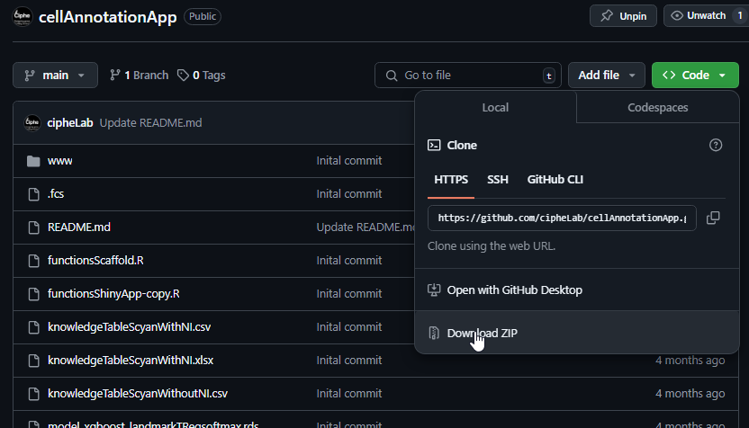

# Cell Annotation App

## Description
The Cell Annotation App is a Shiny web application designed to facilitate the annotation of cytometry data. This tool allows users to upload FCS files, apply necessary preprocessing transformations, and use various algorithms for cell annotation. The results can be visualized and downloaded for further analysis.

## Features
- **Upload and View Data**: Load one or more FCS files.
- **Preprocessing**: Apply compensation and transformation to the data.
- **Annotation Algorithms**: 
  - **XGBoost**: Use a machine learning model for cell annotation.
  - **Scyan**: Apply the Scyan algorithm with a knowledge table for annotation.
  - **Scaffold**: Perform clustering and build Scaffold maps for annotation.
- **Results Visualization**: View and analyze the annotation results.
- **Download**: Export the annotated FCS files and results.

## Installation
cellAnnotationApp can be installed and run using Docker. You can install it in your own laptop.

Follow the procedure :

1. Install docker h[ttps://docs.docker.com/desktop/install/](https://docs.docker.com/engine/install/)
2. Clone the cellAnnotationApp repertory with git **or manually**.
Clone with git : 
  ```sh
git clone https://github.com/cipheLab/cellAnnotationApp.git
  ```

4. Launch cellAnnotationApp:
   - Open a terminal
   - run the following command :

Go to the repertory (replace 'path/To/Repertory' by the path to cellAnnotationApp)
  ```sh
cd path/To/Repertory/cellAnnotationApp
  ```
Build docker image
  ```sh
docker build -t cellAnnotationApp
  ```
Launch the docker image 
  ```sh
docker run -p 3838:3838 cellAnnotationApp
  ```
3. Open an internet browser and type :  "http://127.0.0.1:3838". CellAnnotationApp will appear in the bowser.
   

   ## Usage

### Upload and View Data
1. Navigate to the **Upload FCS** tab.
2. Click on the "Upload..." button to select and upload one or multiple FCS files.
3. View the contents of the uploaded files in the table.

### Preprocessing
1. Go to the **Preprocessing** tab.
2. Select the markers to transform and the type of transformation (logicle or arcsinh).
3. Click "Apply" to perform the preprocessing.

### Annotation

#### XGBoost
1. Navigate to the **XGBoost** tab.
2. Load or choose an XGBoost model.
3. Select markers used for prediction.
4. Click "Annotate Selected Files" to perform the annotation.

#### Scyan
1. Go to the **Scyan** tab.
2. Load or build a Scyan knowledge table.
3. Select markers for prediction.
4. Click "Run Scyan Annotation" to perform the annotation.

#### Scaffold
1. Navigate to the **Scaffold** tab.
2. Perform clustering or upload already clustered files.
3. Build or load a Scaffold map.
4. Click "Run Scaffold Annotation" to perform the annotation.

### Results Visualization and Download
1. Go to the **Results** tab to view annotation statistics and visualizations.
2. Click "Download ALL CSV results" to export the results.

## System Requirements
- **OS**: Linux, Windows, or macOS

## Contributing
Contributions are welcome! Please feel free to submit a Pull Request or open an issue.


## Contact
If you have any questions, feel free to reach out to [maelle-marine.monier@inserm.fr].

